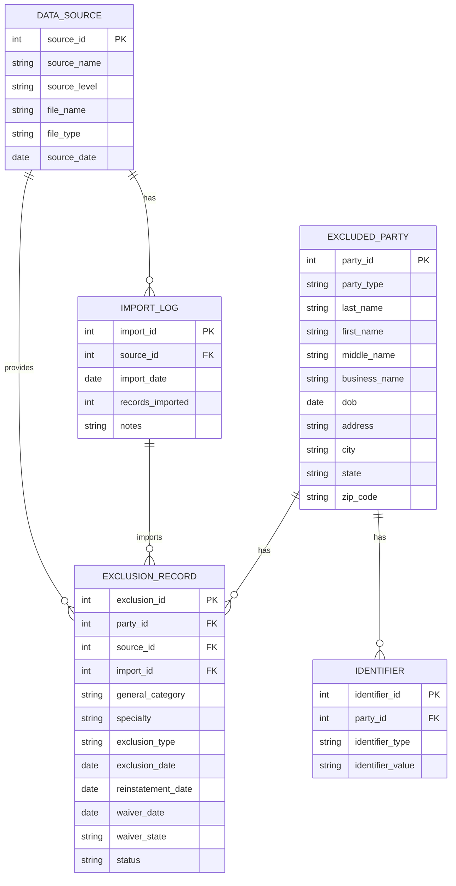

```mermaid
erDiagram
    DATA_SOURCE {
        int source_id PK
        string source_name
        string source_level
        string file_name
        string file_type
        date source_date
    }

    IMPORT_LOG {
        int import_id PK
        int source_id FK
        date import_date
        int records_imported
        string notes
    }

    EXCLUDED_PARTY {
        int party_id PK
        string party_type
        string last_name
        string first_name
        string middle_name
        string business_name
        date dob
        string address
        string city
        string state
        string zip_code
    }

    IDENTIFIER {
        int identifier_id PK
        int party_id FK
        string identifier_type
        string identifier_value
    }

    EXCLUSION_RECORD {
        int exclusion_id PK
        int party_id FK
        int source_id FK
        int import_id FK
        string general_category
        string specialty
        string exclusion_type
        date exclusion_date
        date reinstatement_date
        date waiver_date
        string waiver_state
        string status
    }

    DATA_SOURCE ||--o{ IMPORT_LOG : has
    DATA_SOURCE ||--o{ EXCLUSION_RECORD : provides
    IMPORT_LOG ||--o{ EXCLUSION_RECORD : imports
    EXCLUDED_PARTY ||--o{ EXCLUSION_RECORD : has
    EXCLUDED_PARTY ||--o{ IDENTIFIER : has
```
